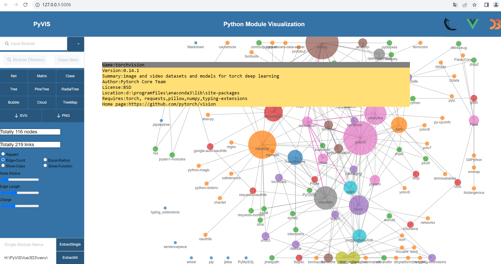
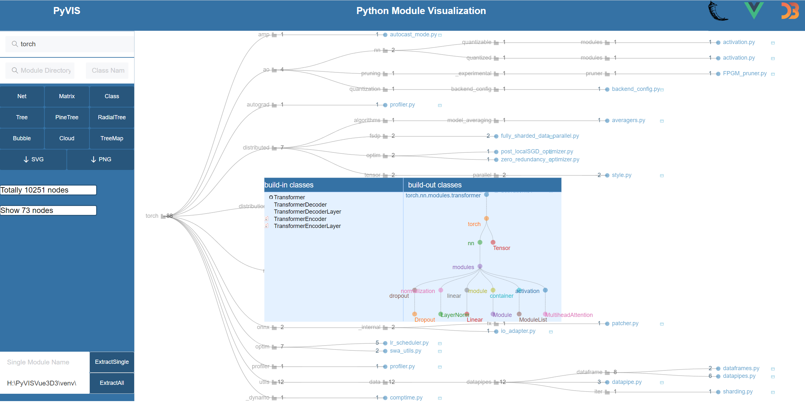
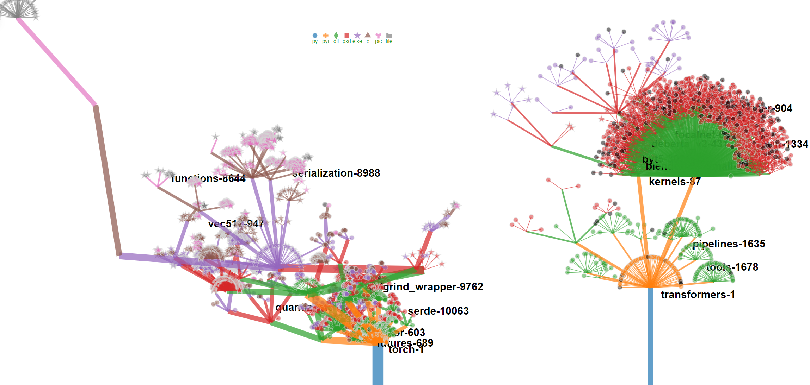
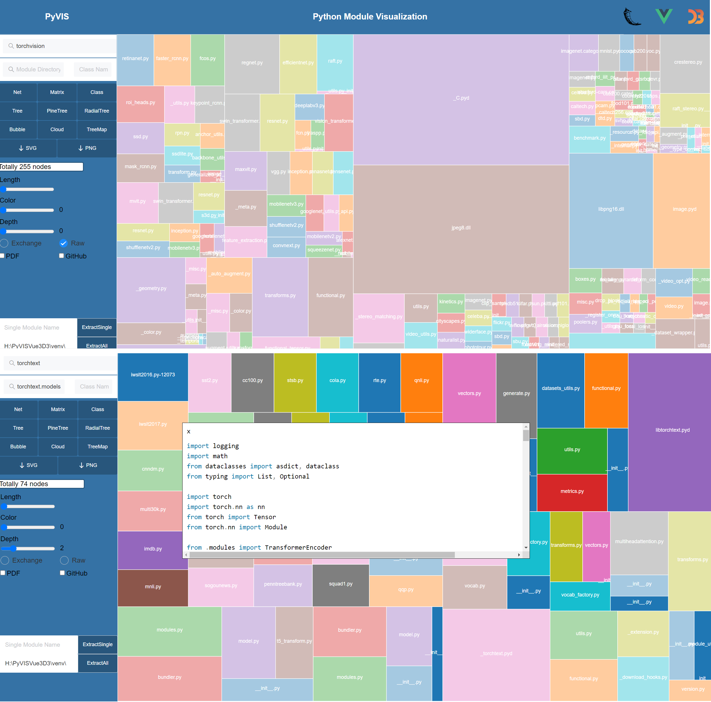

# PyVisVue3D3: Python Module Visualization(Https://pyvisvue3d3.yingshinet.com)

## 1- How can users get started with the project?
To get started with PyVisVue3D3, simply download the source code from https://github.com/CBD-Lab/pyvis. Then install the python module needed here: flask, flask_cores, pipdeptree, requests. Other the third-party packages(such as PyTorch, torchvision, torchtext, transformers) are experiment data.
compile main.py to run the whole project. Open the link http://127.0.0.1:5006/ on the browser to use the tool.

## 2- How can you extract python modules in your local environment?
Focus on the left region and click the button [ExtractAll] to extract all modules in your local vertual 
environment(venv), the backend programming will scan your site-packages directory and analyze all
modules to generate some .json files provided for visualization and module analysis. Also if you
want to view details of certain module or to update the specific information, It’s available to input
the module name and click the button [ExtractSingle] to extract message of the module again.

## 3- Entire Package Environment Visualization

### (1) Net json file
The default whole environment module visualization file would be called to show the relations between all packages with a force-directed graph when you open the link http://127.0.0.1:5006/.
You can input or select a package name, then the package will be displayed.  And click the LOGO[PyVIS], return to the front page.

### (2) Tree json file
Click the [tree] button to show the hierarchical tree graph of the extracted tree json file.

## 4- Single Package Visualization

### (1) Retrieval
Input the package name in the first search box and press enter, also it is available to pull the
dropdownlist to choose the package name without input. After this operation, the whole
visualization will use the data of the package selected.
For the second search box, input the package directory in the left column, the class name in
the right column(not necessary), thus it is available to retrieval python document and code at any
directory and file.

### (2) Net Layout: force-directed graph visualization
Click the [Net] button to display a force-directed graph illustrating the relationships of modules(.py). If you want to change the style of the force-directed graph, a control area list three option regions for you.

### (3) Matrix Layout: matrix diagram visualization
Click the [Matrix] button to display a Matrix diagram illustrating the relationships with interaction.

### (4) Class Layout: class force-directed graph visualization
Click the [Class] button, Class call graph(only parent-children relations) will be shown within a package.

### (5) Basic Tree Layout
Click the [Tree] button, the tree provides a hierarchy structure of a package. Once you click the leaf node, detailed information is provided with a pop-up window.

### (6) PineTree Layout: tree diagram visualization
Click the [PineTree] button to display a new PineTree layout of overview of a package folder.

### (7) RadialTree Layout: radialtree visualization
Click the [RadialTree] button to display a RadialTree indicating the hierarchical status of the relevant directories and files.

### (8) Bubble Module: bubble diagram visualization
Click the [Bubble] button to display a Bubble diagram indicating the hierarchical status of the relevant directories and files. 

### (9) Cloud Module: wordcloud visualization
Click the [Cloud] button to display a word cloud map indicating the hierarchical status of the relevant directories and files. 

### (10) TreeMap Module: treemap visualization
Click the [TreeMap] button to display a treemap indicating the hierarchical status of the relevant directories and files. 

## 5- Download figures
On the left control region two download buttons are provided for obtaining the visualization figures if you need.

## 6- Who maintains and contributes to the project?
PyVisVue3D3 is sponsored by Chunfang Li(Communication University of China), and the development of this software has been contributed to by Junli Lu, Yuchen Pei, Yalv Fan, Yuanzhi Tian, Xiaoyu Linghu, and Kun Wang.

# Thanks for your attention and suggestion.
